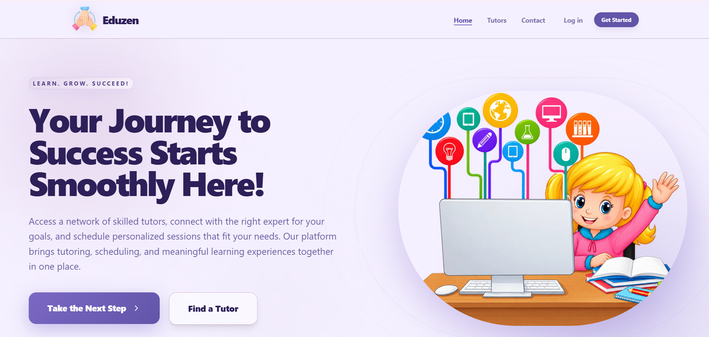
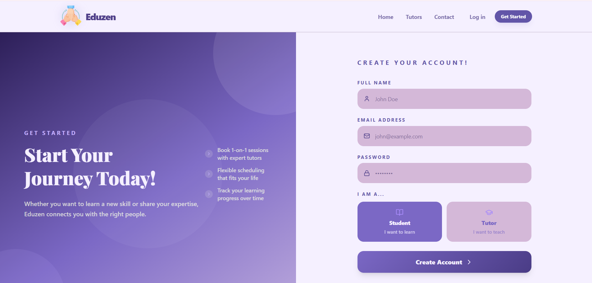
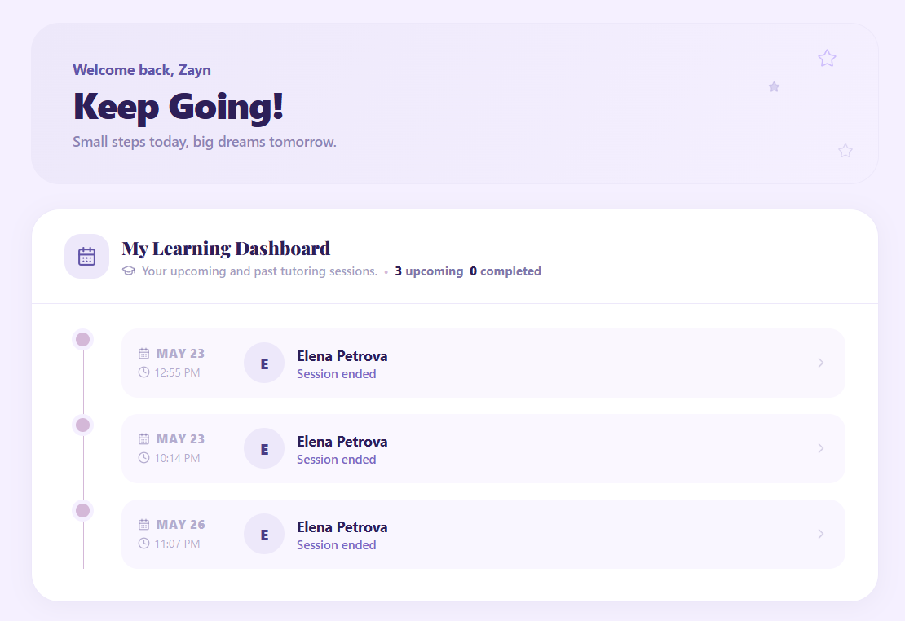
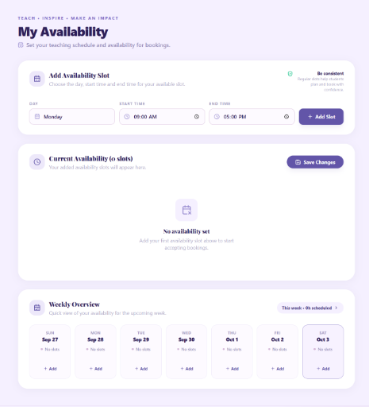
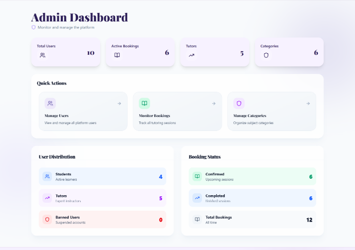

<div align="center">


# Eduzen

### A full-featured tutoring marketplace, built for real learning relationships.

Students find the right expert. Tutors run their teaching like a business. Everyone keeps moving forward.

[](https://nextjs.org/)
[](https://www.typescriptlang.org/)
[](https://tailwindcss.com/)
[](https://www.framer.com/motion/)
[](https://www.prisma.io/)
[](https://www.postgresql.org/)

**[Live App](https://eduzen-livid.vercel.app/)**

</div>

<br />

<div align="center">
  
</div>

<br />

## What it does

Eduzen connects students with vetted, expert tutors for personalized, on-demand learning sessions. Role-based dashboards for students, tutors, and admins, real-time booking management, tutor availability scheduling, student reviews, and a fully responsive, animated UI.

<br />

## A look inside

<table>
  <tr>
    <td width="50%" valign="top">
      
      <p align="center"><strong>Onboarding</strong><br/>Join as a student or a tutor in one flow</p>
    </td>
    <td width="50%" valign="top">
      
      <p align="center"><strong>Student Dashboard</strong><br/>Every session, tracked on a live timeline</p>
    </td>
  </tr>
  <tr>
    <td width="50%" valign="top">
      
      <p align="center"><strong>Tutor Availability</strong><br/>Set a weekly teaching schedule in seconds</p>
    </td>
    <td width="50%" valign="top">
      
      <p align="center"><strong>Admin Control Panel</strong><br/>Platform-wide visibility, at a glance</p>
    </td>
  </tr>
</table>

<br />

## Built with

| Layer | Stack |
|---|---|
| **Frontend** | Next.js · TypeScript · Tailwind CSS · Framer Motion · TanStack Query · Zustand |
| **Backend** | Express.js · Prisma ORM · PostgreSQL (Neon) |
| **Media** | Cloudinary (profile photo uploads) |
| **Auth** | JWT, role-based authorization (Student / Tutor / Admin) |

<br />

## Highlights

- **Role-based dashboards** — distinct experiences for students, tutors, and admins, gated by JWT auth
- **Live availability scheduling** — tutors set weekly slots; students book against real open times
- **Animated session timeline** — students see upcoming and past sessions as a connected, scroll-revealed timeline
- **Instant video rooms** — one click opens a real meeting room, generated per booking
- **Cloudinary photo uploads** — tutors and students can personalize their profiles with a real photo
- **Fully responsive** — built mobile-first, polished down to small screens

<br />

## Pages

<details>
<summary><strong>Public</strong></summary>
<br/>

| Page | Route | Description |
|------|-------|-------------|
| Home | `/` | Landing page — hero, top tutors, features, steps |
| Browse Tutors | `/tutors` | Search by name, filter by category |
| Tutor Profile | `/tutors/:id` | Bio, reviews, availability, booking card |
| Contact | `/contact` | Reach the team with a reason-based form |
| Login | `/login` | JWT-based authentication |
| Register | `/register` | Sign up as student or tutor |

</details>

<details>
<summary><strong>Student Dashboard</strong></summary>
<br/>

| Page | Route | Description |
|------|-------|-------------|
| Bookings | `/dashboard` | Session timeline, upcoming and completed |
| Profile | `/dashboard/profile` | Edit name, email, and profile photo |

</details>

<details>
<summary><strong>Tutor Dashboard</strong></summary>
<br/>

| Page | Route | Description |
|------|-------|-------------|
| Sessions | `/tutor/dashboard` | View all incoming bookings |
| Availability | `/tutor/availability` | Set weekly time slots |
| Profile | `/tutor/profile` | Edit bio, hourly rate, subjects, photo |

</details>

<details>
<summary><strong>Admin Panel</strong></summary>
<br/>

| Page | Route | Description |
|------|-------|-------------|
| Dashboard | `/admin` | Platform stats overview |
| Users | `/admin/users` | View, ban, and unban users |
| Bookings | `/admin/bookings` | View all platform bookings |
| Categories | `/admin/categories` | Create, edit, delete subjects |

</details>

<br />

## Getting started

**Prerequisites:** Node.js 18+, a PostgreSQL database (local or [Neon](https://neon.tech))

```bash
# 1. Clone both repos
git clone https://github.com/noor00111/Eduzen
git clone https://github.com/noor00111/Eduzen-backend

# 2. Set up the backend
cd eduzen-backend
npm install
npx prisma migrate dev
npm run seed
npm run dev

# 3. Set up the frontend
cd ../Eduzen
npm install
npm run dev
```

<br />

## Test accounts

| Role | Email | Password |
|------|-------|----------|
| Admin | `admin@Eduzen.com` | `admin123` |
| Tutor | `tutor1@test.com` | `tutor123` |
| Student | `student1@test.com` | `student123` |